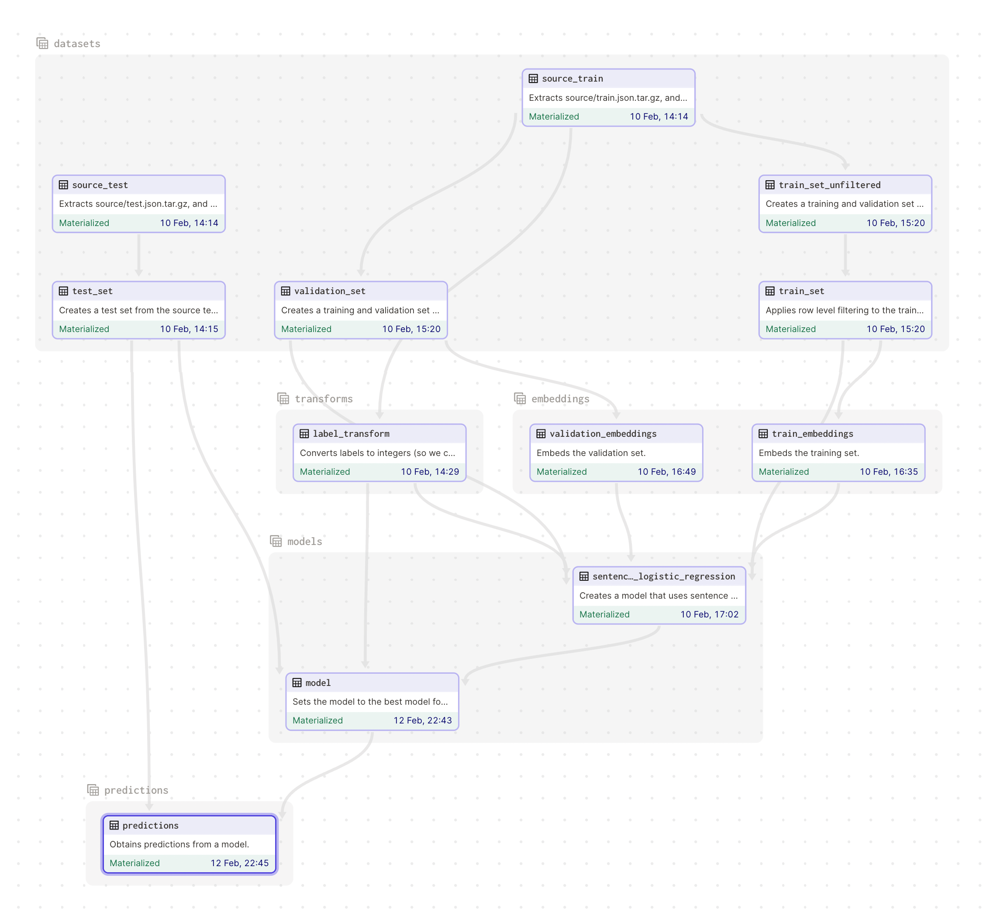

# Text Classification

An example to showcase how to perform text classification.

* [Notes](docs/notes.md)

## Notebooks

* [Exploratory Data Analysis](notebooks/eda.ipynb). [Source](notebooks/eda.py).
* [Evaluating TFIDF Logistic Regression Model](notebooks/evaluating_tfidf_logistic_regression_model.ipynb). [Source](notebooks/evaluating_tfidf_logistic_regression_model.py).
* [Interpreting TFIDF Logistic Regression Model](notebooks/interpreting_tfidf_logistic_regression_model.ipynb). [Source](notebooks/interpreting_tfidf_logistic_regression_model.py).
* [Visualize Embeddings](notebooks/visualize_embeddings.ipynb). [Source](notebooks/visualize_embeddings.py).

## Summary

* Business Understanding
    * What is the problem?
        * Classifying new news articles into 10 different categories.
        * a.k.a. a multi-class classification problem.
        * Some evidence that this could be better framed as a multi-label classification problem.
        * Also class imbalance is a problem. We have a lot more samples from some classes than others.
    * What is available?
        * A training dataset of 65,000 news articles.
        * Samples contain some short text features (`headline` and `short_description`).
    * What does a solution look like?
        * A performant baseline model was TF-IDF + Logistic Regression.
        * So can look out for informative words in the text features.
        * e.g. "climate" for class "B".
* Data Preparation
    * What tools will you use and why?
        * `scikit-learn` for the TF-IDF + Logistic Regression baseline.
        * `imbalanced-learn` for good metrics in the presence of class imbalance.
        * `sentence-transformers` for creating sentence embeddings.
        * `pytorch-lightning` for convenience in training neural networks.
        * `tensorboard` for visualizing the embeddings and experiments.
        * `dagster` for keeping track of data asset lineage and experiments.
    * What steps are necessary?
        * Start with Exploratory Data Analysis (EDA).
        * Transform class labels into integers (wth `LabelEncoder`).
        * Select text features.
        * Concatenate text features (as part of `TFIDFVectorizer`).
        * And tokenize (as part of `TFIDFVectorizer` or `sentence-transformers`).
* Model Building
    * What model(s) will you use and why?
        * Some trivial baseline models. (e.g. most common label)
            * Useful for sanity checking and establishing a baseline for metrics.
        * A baseline model. (e.g. TF-IDF + Logistic Regression)
            * Good baseline before looking at more complex models (like neural networks).
            * Uses a bag-of-words approach so had very interpretable features.
        * A neural network model. (e.g. `pytorch-lightening` + `sentence-transformers`)
            * Might need to learn more complex contextualized patterns.
    * How do you interpret and validate your models(s)?
        * On a hold out validation set (for choosing model and hyper-parameters).
        * Using Macro Average F1 Score (suitable for imbalanced classification).
        * Inspect failure cases.
        * Create a confusion matrix (would be done with more time).
* Productization Plan
    * Once your model is ready how do you "deploy" it?
        * Canary deployment, with a rollback plan.
        * With metrics monitoring.
        * With a retraining strategy (e.g. retrain every week).
* Storytelling
    * What are the main results/insights? What is the value of the model?
        * We have a good idea on what the classes are (e.g. "A" is "Arts").
        * We know what words the model thinks is important (e.g. "climate" for class "B").
        * Complexity/performance trade-off seems to be in favour of the baseline model.
        * Suspect that there is some irreducible error in the data, because the problem might be multi-label instead of multi-class.

## Data Flow

All the stages for generating the final model predictions are show below. Other models were tried, but not shown.

## Improvements

* Compute a class confusion matrix for model evaluation.
* Apply hyper-parameter tuning to the models.
* Check token length distribution, not just character length distribution.
* Could fine-tune language model (so it can pick up on keywords). GPU useful for this.
* Could apply metric learning to get better separation between classes.
